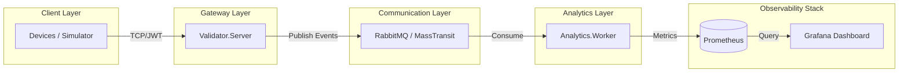
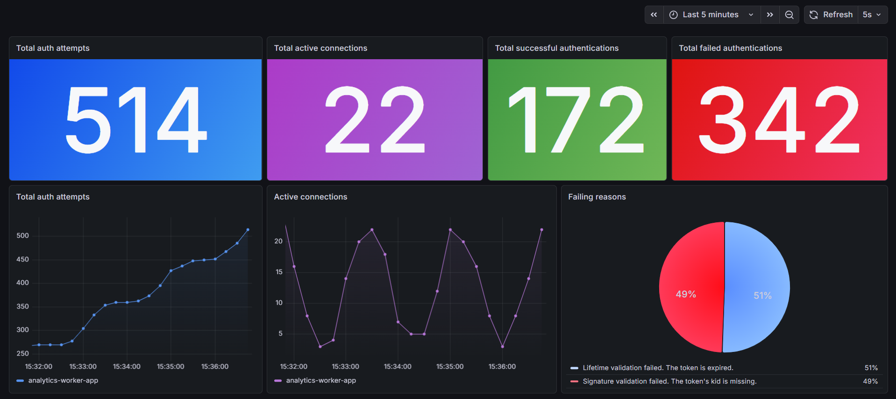

# JwtSecurity.Lab

A distributed .NET lab demonstrating secure JWT authentication, stateful TCP connection management, and real-time
observability.

---

#### 🏗️ Architecture

The system is divided into two primary domains communicating via a message bus (MassTransit/RabbitMQ):

- **Validator.Server:** A high-concurrency TCP gateway. It manages stateful device connections using
  `ConcurrentDictionary`, performs JWT validation, and emits telemetry events.
- **Analytics.Worker:** An event-driven service that consumes authentication events and updates real-time metrics (Prometheus/Grafana).
- **Simulator:** A multi-threaded, distributed telemetry simulator that tests both valid traffic and security-sensitive
  scenarios.

--- 

#### 🛠️ Key Technical Features

- **Stateful Connection Management:** Uses `ConcurrentDictionary` for thread-safe session tracking, ensuring accurate
  `ActiveConnection` monitoring without race conditions.
- **Event-Driven Observability:** Decouples validation logic from telemetry collection using an asynchronous message
  bus, ensuring that monitoring overhead never impacts connection latency.
- **Real-time Metrics Pipeline:** Implements the Gauge vs. Counter pattern to provide both instantaneous system
  snapshots (e.g., current active users) and historical throughput analysis (e.g., auth attempts).
- **Resilience & Graceful Shutdown:** Robust error handling and lifecycle management that ensures metrics are always
  consistent and connections are disposed of cleanly.

---

### 🏗 Architecture Diagram



---

#### 📊 Observability Dashboard (Grafana)

The dashboard is designed to provide a comprehensive view of system health, utilizing three distinct visualization
patterns:

- **Stats Panels:** For immediate status of throughput and active connections.
- **Time Series:** To track trends and traffic spikes over time.
- **Pie Chart:** To identify root causes by grouping failure reasons (e.g., token expiration vs. signature mismatch).



##### Metrics Exposed:

| Metric                   | Type    | Purpose                                                    |
|:-------------------------|:--------|:-----------------------------------------------------------|
| active_connections_total | Gauge   | Tracks real-time stateful TCP connections                  |
| auth_success_total       | Counter | Monitors overall successful throughput.                    |
| auth_failures_total      | Counter | Categorized by reason and device_id for security auditing. |
| auth_attempts_total      | Counter | Tracks total system load and traffic volume.               |

---

### 🚀 Getting Started

1. **Start the Infrastructure:** Ensure you have RabbitMQ, Prometheus, and Grafana running. A `docker-compose.yml` is
   provided in the root to spin these up instantly:

  ```dash
  docker compose up -d
  ```

2. **Launch the Services:** Run the following applications locally
    - Run the `Validator.Server` to start the TCP gateway.
    - Run the `Analytics.Worker` to begin processing events.

3. **Run the Simulator:** Launch `Simulator` to inject traffic and observe the dashboard in real-time..

---

Built with: NET 10 | MassTransit | RabbitMQ | Prometheus | Grafana | Clean Architecture | Async-First Design
